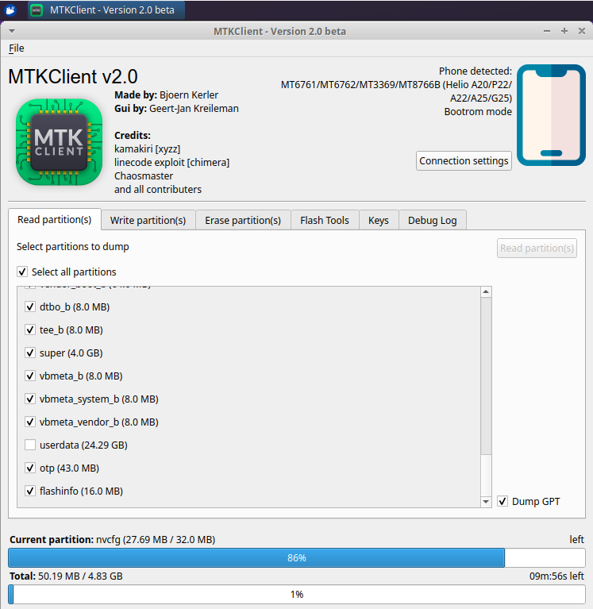

# Unlocking the Bootloader

{{ mt8766_warning_subdir }}

## Overview

Unlocking the bootloader enables advanced modifications including custom recovery, custom ROMs, and root access. The bootloader is a security checkpoint that verifies device software—unlocking it removes these restrictions.

```{admonition} What you'll accomplish
- Unlock your device's bootloader for advanced modifications
- Prepare for rooting, custom ROMs, and other modifications
```

```{warning}
**Data Loss Risk:** Unlocking the bootloader will factory reset your device, erasing all data.
```

This guide uses [MTKClient](https://github.com/bkerler/mtkclient), an open-source tool for MediaTek-based devices.

## Prerequisites

- [MTKClient](https://github.com/bkerler/mtkclient) installed and working
- Python 3.9 or newer
- USB drivers for MediaTek devices
- Quality USB data cable
- Developer Options enabled with OEM unlocking (see below)

### Enable Developer Options

1. Navigate to **Settings → About Phone**
2. Tap **Build Number** seven times
3. Go to **System → Developer Options**
4. Enable **OEM unlocking**
5. Enable **USB debugging**

## Unlock Using MTKClient

::::{tab-set}

:::{tab-item} GUI
1. **Launch GUI:**
   ```bash
   python mtk_gui
   ```

2. **Power off device**

3. **Navigate to "Flashing" tab → Click "Unlock Bootloader"**

4. **Enter BROM mode:**
   - Hold **Owl/Heart button** (top left) + **Back button**
   - While holding, plug in USB cable
   - Keep holding until device detected

5. **Wait for completion, then reset device**
:::

:::{tab-item} CLI
1. **Power off device completely**

2. **Run unlock and factory reset commands** in MTKClient directory:
   ```bash
   python mtk e metadata,userdata,md_udc
   python mtk da seccfg unlock
   ```

3. **Enter BROM mode:**
   - Hold **Owl/Heart button** (top left) + **Back button**
   - While holding, plug in USB cable
   - Keep holding until device detected

4. **Wait for completion** (10-30 seconds)

   **Note:** Some users need to reconnect USB multiple times. If stuck, disconnect and re-enter BROM mode.

5. **Reboot device:**
   ```bash
   python mtk reset
   ```
:::

::::

## Verification

After unlocking, you'll see an **Orange State** warning on boot:

```
Orange State
Your device has been unlocked and can't be trusted
Your device will boot in 5 seconds
```

This is completely normal and confirms successful unlock. Some Google Play pre-installed devices may not show this message.

## Post-Unlock: Create Backup

Create a complete backup before making any modifications. You'll need about 5GB of free disk space:

::::{tab-set}

:::{tab-item} GUI
1. **Power off device**

2. **Launch GUI:**
   ```bash
   python mtk_gui
   ```

3. **Enter BROM mode** (hold Owl/Heart + Back, plug USB)

4. **Go to "Read partition(s)" tab**

5. **Click "Select all partitions"**

6. **Optionally uncheck "userdata"** (encrypted personal data)

7. **Enable "Dump GPT"**

8. **Click "Read Partition(s)"** and choose save location

   

9. **Back up preloader** from "Flash Tools" tab
:::

:::{tab-item} CLI
1. **Power off device**

2. **Read all partitions** in MTKClient directory:
   ```bash
   python mtk rl backup --skip=userdata
   ```

   To include userdata (encrypted personal data):
   ```bash
   python mtk rl backup
   ```

3. **Enter BROM mode:**
   - Hold **Owl/Heart button** (top left) + **Back button**
   - While holding, plug in USB cable
   - Keep holding until device detected

4. **Wait for backup to complete**

   Partitions will be saved to the `backup` directory in your MTKClient folder.
:::

::::


## Troubleshooting

### Device Not Detected

If [MTKClient](https://github.com/bkerler/mtkclient) shows "Waiting for PreLoader VCOM" indefinitely:

- Ensure MediaTek USB drivers installed properly
- Use quality **data** cable (not charging-only)
- Try different USB ports (USB 3.0/3.1 often work better)
- Verify button combination: Owl/Heart (top left) + Back
- Confirm device fully powered off
- Windows: Check Device Manager for MediaTek device
- Try Preloader mode: plug USB without holding buttons

### Process Freezes

- Unplug USB, wait 5 seconds, reconnect in BROM mode
- Multiple reconnection attempts may be needed
- Don't touch cable/device during process
- Try USB 2.0 port instead of 3.0

## Relocking the Bootloader

```{danger}
**Only relock with completely stock, unmodified system partitions.**
Relocking with modifications will brick your device.
```

1. Restore to stock firmware
2. Verify all partitions unmodified
3. Power off device
4. Run: `python mtk da seccfg lock`
5. Enter BROM mode when prompted
6. Wait for completion and reboot
